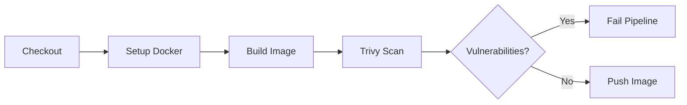
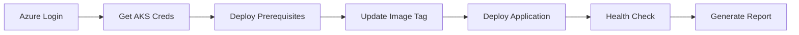

# GitHub Actions CI/CD Pipeline Documentation

This directory contains the GitHub Actions workflow for building, scanning, and deploying the WebGoat Core .NET application to Azure Kubernetes Service (AKS) with comprehensive security scanning using Trivy.

## 📋 Workflow Overview

| Workflow | File | Description |
|----------|------|-------------|
| **Build, Scan, and Deploy** | `build-deploy.yml` | Complete CI/CD pipeline with security scanning |

## 🔄 Pipeline Flow

### **Triggers**
- Push to `main` or `develop` branches
- Pull requests to `main` branch
- Manual workflow dispatch

### **Jobs Architecture**
```
┌─────────────┐    ┌─────────────┐
│    BUILD    │───▶│   DEPLOY    │
│             │    │             │
│ • Build     │    │ • AKS Login │
│ • Scan      │    │ • Deploy    │
│ • Push      │    │ • Verify    │
└─────────────┘    └─────────────┘
```

## 🔒 Security Scanning with Trivy

### **Trivy Integration Specifications**
- **Manual Installation**: Uses apt package manager for Trivy installation
- **Action Version**: `aquasecurity/trivy-action@0.28.0` for SARIF format
- **Output Formats**: 
  - **Table**: Human-readable console output
  - **SARIF**: GitHub Security tab integration
  - **JSON**: Programmatic processing
- **Severity Levels**: `CRITICAL,HIGH`
- **Exit Code**: `1` for critical/high vulnerabilities
- **Ignore Unfixed**: `true` (ignores vulnerabilities without fixes)

### **Security Scan Process**
1. **Build Docker Image** - Create container image
2. **Table Scan** - Display results in GitHub Summary
3. **SARIF Scan** - Upload to GitHub Security tab
4. **Exit Code Scan** - Fail pipeline on critical/high vulnerabilities
5. **Report Generation** - Create detailed security report
6. **Artifact Upload** - Store scan results for 30 days

## 🚀 Deployment Process

### **Target Environment**
- **Platform**: Azure Kubernetes Service (AKS)
- **Registry**: Azure Container Registry (ACR)
- **Namespace**: `dotnet-namespace`
- **Deployment**: `dotnet-app`

### **Deployment Steps**
1. **Azure Authentication** - Using service principal
2. **AKS Connection** - Get cluster credentials
3. **Prerequisites** - Deploy ConfigMaps, Secrets, RBAC
4. **Application Deployment** - Deploy with dynamic image tag
5. **Health Verification** - Validate deployment success
6. **Summary Generation** - Create deployment report

## 🔧 Required Secrets Configuration

Configure these secrets in your GitHub repository settings (`Settings` → `Secrets and variables` → `Actions`):

### **Azure Authentication**
| Secret Name | Description | Example Value |
|-------------|-------------|---------------|
| `AZURE_CLIENT_ID` | Service Principal Application ID | `12345678-1234-1234-1234-123456789012` |
| `AZURE_CLIENT_SECRET` | Service Principal Password | `your-service-principal-secret` |
| `AZURE_SUBSCRIPTION_ID` | Azure Subscription ID | `87654321-4321-4321-4321-210987654321` |
| `AZURE_TENANT_ID` | Azure Tenant ID | `abcdef12-3456-7890-abcd-ef1234567890` |

### **Container Registry**
| Secret Name | Description | Example Value |
|-------------|-------------|---------------|
| `REGISTRY_LOGIN_SERVER` | ACR Login Server | `myregistry.azurecr.io` |
| `REGISTRY_USERNAME` | ACR Username | `myregistry` |
| `REGISTRY_PASSWORD` | ACR Password | `acr-admin-password` |

### **AKS Cluster**
| Secret Name | Description | Example Value |
|-------------|-------------|---------------|
| `AKS_CLUSTER_NAME` | AKS Cluster Name | `my-aks-cluster` |
| `AKS_RESOURCE_GROUP` | Azure Resource Group | `my-resource-group` |

## 🏗️ Image Tagging Strategy

### **Build ID Generation**
```bash
BUILD_ID="${GITHUB_SHA::8}-$(date +%s)"
```

### **Image Tags**
- **Unique Tag**: `{registry}/{image}:{build-id}`
- **Latest Tag**: `{registry}/{image}:latest`

**Example:**
- `myregistry.azurecr.io/webgoat-core:a1b2c3d4-1642608000`
- `myregistry.azurecr.io/webgoat-core:latest`

## 📊 Monitoring & Reporting

### **GitHub Integration**
- **Step Summary**: Real-time pipeline status and results
- **Security Tab**: SARIF vulnerability reports
- **Artifacts**: Downloadable scan results and deployment summaries
- **Environments**: Production/Development environment tracking

### **Generated Artifacts**
| Artifact | Description | Retention |
|----------|-------------|-----------|
| `security-scan-results-{build-id}` | Trivy scan outputs (SARIF, JSON, Table) | 30 days |
| `deployment-summary-{run-number}` | Deployment status and resource information | 30 days |

## 🔍 Security Features

### **Container Security**
- ✅ **Vulnerability Scanning**: Trivy scans for OS and application vulnerabilities
- ✅ **Critical/High Blocking**: Pipeline fails on dangerous vulnerabilities
- ✅ **SARIF Integration**: Results visible in GitHub Security tab
- ✅ **Multi-format Output**: Table, SARIF, and JSON formats
- ✅ **Unfixed Filtering**: Ignores vulnerabilities without available fixes

### **Deployment Security**
- ✅ **Service Principal Authentication**: Secure Azure access
- ✅ **Namespace Isolation**: Deployment to dedicated namespace
- ✅ **Resource Validation**: Verify deployment success
- ✅ **Health Checks**: Application readiness verification
- ✅ **Network Policies**: Applied during deployment

### **Pipeline Security**
- ✅ **Secrets Management**: Secure credential handling
- ✅ **Environment Protection**: Production deployment controls
- ✅ **Artifact Signing**: Container image integrity
- ✅ **Audit Trail**: Complete deployment history

## 🚦 Pipeline Stages

### **1. Build Stage**


### **2. Deploy Stage**


## 🔧 Customization Options

### **Environment-Specific Configuration**
```yaml
# Modify deployment based on branch
environment:
  name: ${{ github.ref == 'refs/heads/main' && 'production' || 'development' }}
```

### **Security Scan Customization**
```yaml
# Adjust Trivy scanning parameters
trivy image \
  --format table \
  --severity CRITICAL,HIGH,MEDIUM \  # Add MEDIUM if needed
  --ignore-unfixed \
  --timeout 10m \                    # Adjust timeout
  --exit-code 1 \
  ${{ steps.meta.outputs.tags }}
```

### **Deployment Conditions**
```yaml
# Deploy only on specific branches
if: success() && (github.ref == 'refs/heads/main' || github.ref == 'refs/heads/develop')
```

## 🛠️ Troubleshooting

### **Common Issues**

#### **Build Failures**
- **Docker Build Errors**: Check Dockerfile syntax and base image availability
- **Registry Login**: Verify ACR credentials and permissions
- **Resource Limits**: Ensure sufficient GitHub Actions runner resources

#### **Security Scan Failures**
- **Critical Vulnerabilities**: Update base images and dependencies
- **Trivy Installation**: Check apt repository availability
- **Scan Timeout**: Increase timeout values for large images

#### **Deployment Failures**
- **AKS Authentication**: Verify service principal permissions
- **Namespace Issues**: Ensure namespace exists or can be created
- **Resource Quotas**: Check cluster resource availability
- **Health Check Failures**: Verify application health endpoints

### **Debug Commands**
```bash
# Check pipeline logs in GitHub Actions
# View security scan results in artifacts
# Verify AKS deployment status
kubectl get pods -n dotnet-namespace
kubectl logs -n dotnet-namespace -l app=dotnet-app

# Test health endpoints
kubectl port-forward -n dotnet-namespace svc/dotnet-service 8080:80
curl http://localhost:8080/health
```

## 📈 Performance Considerations

### **Build Optimization**
- **Docker Layer Caching**: Uses GitHub Actions cache
- **Multi-stage Builds**: Reduces final image size
- **Parallel Jobs**: Build and scan run concurrently where possible

### **Deployment Efficiency**
- **Rolling Updates**: Zero-downtime deployments
- **Health Checks**: Rapid failure detection
- **Resource Limits**: Optimal resource allocation

## 🔄 Maintenance

### **Regular Updates**
- **Action Versions**: Update to latest stable versions
- **Base Images**: Keep container images updated
- **Dependencies**: Update NuGet packages regularly
- **Security Policies**: Review and update scanning policies

### **Monitoring Recommendations**
- **Pipeline Success Rate**: Track deployment success metrics
- **Security Scan Trends**: Monitor vulnerability trends over time
- **Performance Metrics**: Application deployment and startup times

This pipeline provides a comprehensive, secure, and automated CI/CD solution for your .NET application with industry-standard security practices integrated throughout the deployment process.
